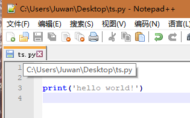
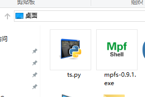
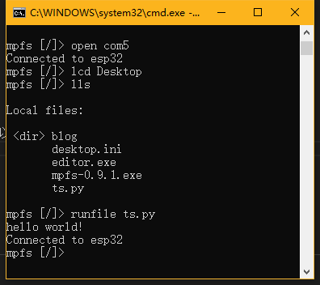

# mpfshell-lite [English](English.md)

[](./LICENSE)
[](https://badge.fury.io/py/mpfshell-lite)

一个简单好用的 Shell 的 Micropython 文件资源管理器⛺

这个 mpfshell 的 lite 版是开发十分激进的版本，稳定版请参见 [mpfshell](https://github.com/wendlers/mpfshell) 。

与稳定版不同的在于，添加了 直接运行代码命令 和 Windows 控制台乱码 和 盘符路径修复 等一系列更适合 Windows 使用的版本。

## 特点：

1. 体积迷你，功能齐全的 MicroPython 管理工具，如：put\get\cat\rm\execfile 等等。

2. 修复 Windows 大量使用问题，路径、乱码等等，但还是存在一些问题在陆续解决。

3. Windows 下绿色单文件，开箱即用，也可使用 Python 跨平台运行。

## 系统要求

- Python 3.5.4 +
- requirements.txt

## 使用方法

### 1. 到 [releases](https://github.com/junhuanchen/mpfshell-lite/releases) 下载 editor.exe。

寻找你所用的系统版本并下载，如果下载很慢，可以用[微云地址](https://share.weiyun.com/5JlPb6T)，下载后双击运行它。


### 2. 使用 PIP 安装

使用 Python 的 PIP 工具下载并安装，在控制台中输入`pip insrall mpfshell-lite`，然后输入 `mpfs` 即可运行。

```shell
pip insrall mpfshell-lite

mpfs
```


## 连接你的硬件

连接你的硬件，此时会出现当前硬件的端口号。

```
looking for all port...
serial name : USB-SERIAL CH340 (COM5)  :  COM5
input ' open COM5 ' and enter connect your board.
```

输入如图的 'open COM5' 即可连接。


可以看到 `Connected to esp32` 已经连接了。

## 运行 micropython 代码。

### 1.直接运行代码

```
mpfs [/]> view
looking for all port...
serial name : USB-SERIAL CH340 (COM5)  :  COM5
current open_args ser:COM5
mpfs [/]> open COM5
Connected to esp32
mpfs [/]> exec print('hello world!')
hello world!
mpfs [/]>
```


### 2.运行代码文件

在 桌面 准备一个 Python 代码文件（.py） 

```python
print('hello world!')
```



- 使用 exe 版本



将 exe 与 .py 放在一起，按以下命令操作。

```
looking for all port...
serial name : USB-SERIAL CH340 (COM5)  :  COM5
input ' open COM5 ' and enter connect your board.

** Micropython File Shell v0.9.1, sw@kaltpost.de & juwan@banana-pi.com **
-- Running on Python 3.5 using PySerial 3.3 --

mpfs [/]> open com5
Connected to esp32
mpfs [/]> runfile ts.py
hello world!
Connected to esp32
mpfs [/]>
```


- 使用 PIP 版本

在 CMD 的控制台模式下，需要使用以下命令，先定位文件夹路径（lcd），再运行文件（runfile）。

可以使用 lcd 定位到运行文件的路径下，如 `lcd C:/Users/Juwan/Desktop` （注意是 / 不是 \，这让人很烦）

```
mpfs [/]> open com5
Connected to esp32
mpfs [/]> lcd Desktop
mpfs [/]> lls

Local files:

 <dir> blog
       desktop.ini
       editor.exe
       mpfs-0.9.1.exe
       ts.py

mpfs [/]> runfile ts.py
hello world!
Connected to esp32
mpfs [/]>
```



## 使用帮助

在程序中，你也可以通过 help + 命令 的方式获取对应的命令说明或参数等细节。


例如：`help cd`， 返回的是 `cd <TARGET DIR>
​        Change current remote directory to given target.`。

可以得知 它是用来改变 目标板子里的当前文件目录起点，相当于设置板子的文件夹默认路径在什么位置。


## 常见错误

连接硬件的时候，要特别注意死循环，如果在连接过程中板子存在没有任何延时的死循环，则会影响软件连接板子的成功率，尤其是没有延时的 main.py 死循环，这会导致上电后将无法连接硬件，你可以在复位连接后 rm main.py，这点需要注意，不过，有线串口的连接不成功则会进行板子的复位（ Mac 例外）。

## 详解工具

### 0. 支持的系统版本

| 系统类型 | 系统版本         | 运行情况 | 注意事项            |
| -------- | ---------------- | -------- | ------------------- |
| Windows  | WIN7 - WIN10     | 正常     | 原生 CMD 不支持 TAB |
| Linux    | Lubuntu - Ubuntu | 正常     | 原生 Shell 支持 TAB |
| Mac      | Darwin           | 正常     | 与 Unix 均一致      |

### 1. 重要的功能操作

| 操作方法                      | 不同系统工具支持情况              | 运行效果                                                     | 注意事项                                                     |
| ----------------------------- | --------------------------------- | ------------------------------------------------------------ | ------------------------------------------------------------ |
| 输入一些内容后通过 TAB 键补全 | 仅 shell、repl、powershell 支持。 | 如果想要打 import 只需要 输入 i 后在按下 TAB 键就可以自动补全了，比如 linux 下，输入 ttyUSB0，只需要 i + TAB 键就可以了。 | 前提是，该命令被系统提前输入过，否则它没办法补全，它只能补全历史输入的信息。 |
| 左键复制选取，右键粘贴选取    | 仅 Windows的系统支持。            | 开启 **CMD控制台** 程序的属性里的 **快速编辑** 功能，可以让程序支持鼠标 点击暂停程序后点左键拖动复制文本内容。 | 如果选取的是多行代码或命令，不代表可以直接使用，所以一般都是选取一行的。 |
| 上下左右按键及退格            | 均支持                            | 上下按键可以切换读取历史输入过的命令，左右方向键以及程序退格操作可以对自己输入过的内容进行修改。 | 仅针对windows做了修复。                                    |

### 2. 所有命令的用法

命令中的括号为简写，方便使用。

| 命令类型     | 使用方法                                                     | 运行结果                                             | 注意事项                                                     |
| ------------ | ------------------------------------------------------------ | ---------------------------------------------------- | ------------------------------------------------------------ |
| open (o)      | 打开当前设备。格式有：有线串口 `open com3`，无线有 `ws:192.168.10.114,1234` | 连接成功后返回 `Connected to esp32`                  | 控制板子前，需要先打开连接。括号为简写。                     |
| close        | 关闭当前设备。                                               |                                                      |                                                              |
| quit (q)         | 输入                                                             | 退出程序                                                   |                                                              |
| EOF          | 输入                                                         | 退出程序                                             | 无                                                           |
| cat (c)          | 输入 文件名，例如 `cat boot.py`                              | 将板子的指定文件内容打印出来，以便快速查看。                   | 无                                                           |
| put          | 把当前目录下的文件推送到板子，例如`put boot.py`              | 无                                                   | 失败会返回错误信息                                           |
| get          | 获取板子当前目录下的文件，例如`get boot.py`                  | 在程序运行的目录（lpwd）下多了一个 boot.py 文件              |                                                              |
| mput         | 与 put 相对，以板子为主，对程序的目录操作。                  |                                                      |                                                              |
| mget         | 与 get 相对，以板子为主，对程序的目录操作。                  |                                                      |                                                              |
| repl (e)      | 进入 python 的 repl 控制接口                                 | 可以直接执行python代码。                             |                                                              |
| exec (e)     | 输入 Python 代码，例如`exec print('hello')`                  | 返回print('hello')的运行结果 hello                   | 只能执行一行 python 代码。括号为简写。                        |
| execfile (ef) | 执行板子中存在的python文件，例如`execfile main.py`           | 执行 main.py 的效果                                  | 括号为简写。                                              |
| lexecfile (lef) | 执行程序下存在的python文件，例如`lexecfile main.py`           | 执行 main.py 的效果                                  | 括号为简写，与 runfile 不同的是会进入repl模式，所以支持input操作。                                              |
| runfile (rf)  | 结合了 put 和 execfile 命令                                  |                                                      | 括号为简写。                                                 |
| cd           | 输入 指定板子里的目录，例如 `cd /` 或  `cd D:/Users`                           | 修改程序访问板子的所处目录                           | 以 `/` 分隔的linux路径。 |
| md           | 输入 目录名称                                                | 在板子上新建一个目录                                 | 无                                                           |
| lcd          | 输入 指定现在程序里的目录，例如 `cd /`                       | 修改程序访问板子的所处目录                           | 以 `/` 分隔的linux路径。 |
| pwd          | 输入`pwd`                                                    | 返回当前板子所处的目录                               | 无                                                           |
| lpwd         | 输入 `lpwd`                                                  | 返回当前程序所处的目录                               | 无                                                           |
| mpyc         | 输入 当前目录下的 python 文件，例如 `mpyc main.py`           | 把 python 代码 pyc 化静态编译代码处理，生成 main.pyc | 需要系统里有 mpy-cross 命令                                                            |
| mrm          | 输入指定的目录或文件名 `rm 目录或文件名`                                     | 移除系统里的该目录或文件名                                           |                                                              |
| rm           | 输入指定的目录或文件名 `rm 目录或文件名`                                     | 移除板子里的该目录或文件名                                           |                                                              |
| ls           | 输入` ls /`                                                  | 查看 板子 当前目录下的所有文件                       |                                                              |
| lls          | 输入 `lls /`                                                 | 查看 程序 当前目录下的所有文件                       |                                                              |
| view          | 输入 `view`                                                 | 查看 本机 可能的串口，和当前的 open 配置                       |                                                              |
| help         | 查看命令的帮助，例如：`help lls`                             |                                                      |

# pyinstaller

1. create mpfs.exe

pyinstaller -F mpfs -i logo.ico

# uplaod pypi

```shell
python setup.py sdist build
```

```shell
# pip install twine
twine upload dist/* --verbose
```

